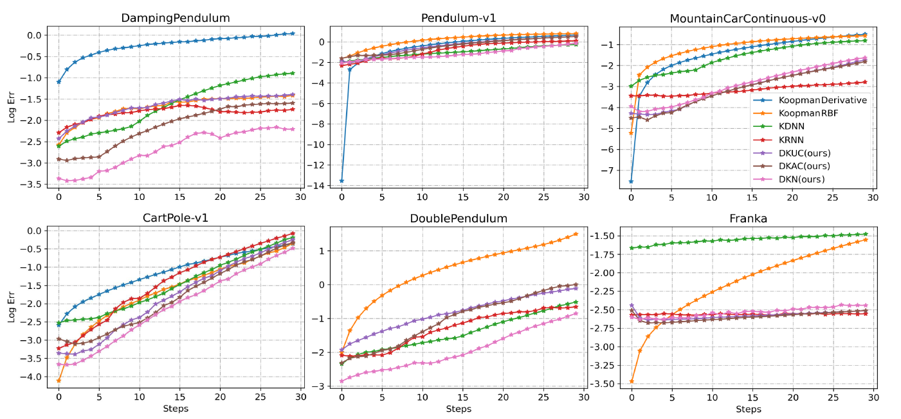

# DeepKoopmanWithControl
Deep Koopman Operator with Control for Nonlinear Systems

Paper: https://arxiv.org/abs/2202.08004 (Accepted by RA-L 2022)

## Prediction



## Control


## Requirement
``` python 
pytorch, gym, pybullet==3.2.1
```
## Environment
For gym environment, you should replace the gym env file with files in folder ./gym_env/

All the environments:
``` python 
"DampingPendulum"
"DoublePendulum"
"Franka"
"Pendulum-v1"
"MountainCarContinous-v0"
"CartPole-v1"
```

## Example
To train the network, you can just run 
``` python 
cd train/
python Learn_koopman_with_KlinearEig.py
```
To evaluate the prediction performance, you can utilize the notebooks in folder prediction/

To evaluate the control performance, you can utilize the notebooks in folder control/

For FrankaControl, please utilize the notebook in ./franka/evaluate_KoopmanAffline_Franka.ipynb and make sure pybullet==3.2.1